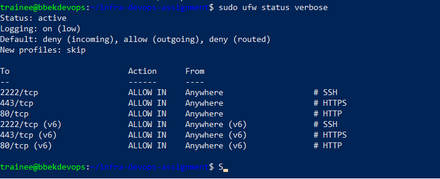
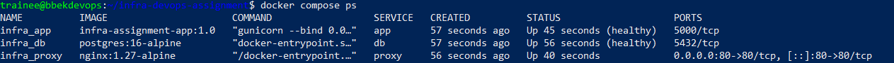
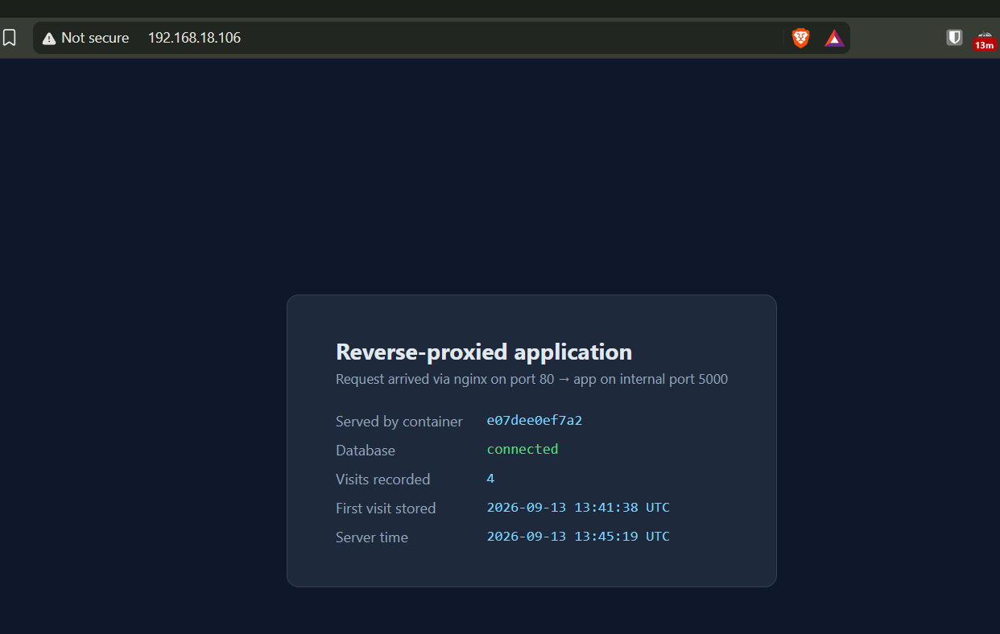
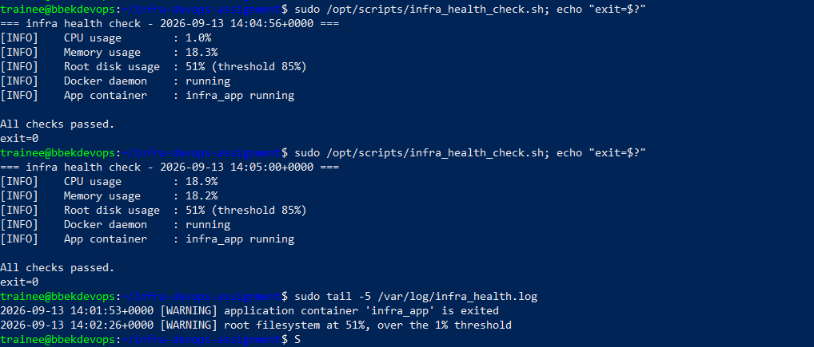
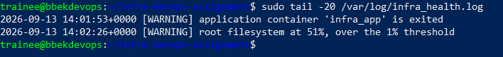
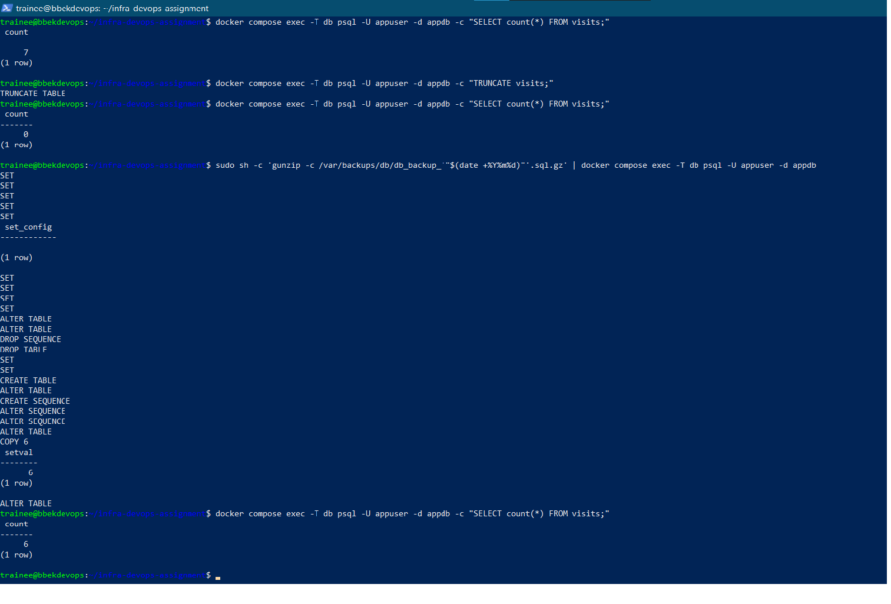
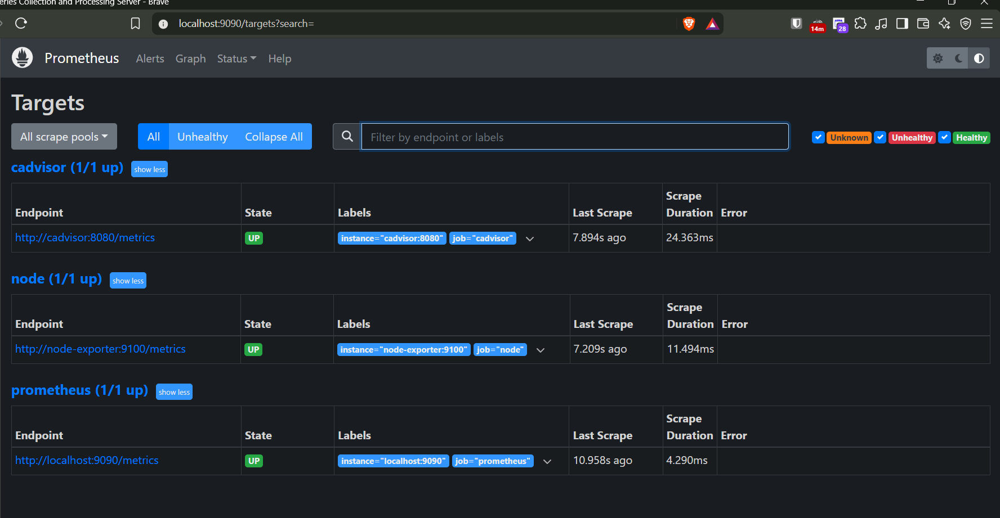
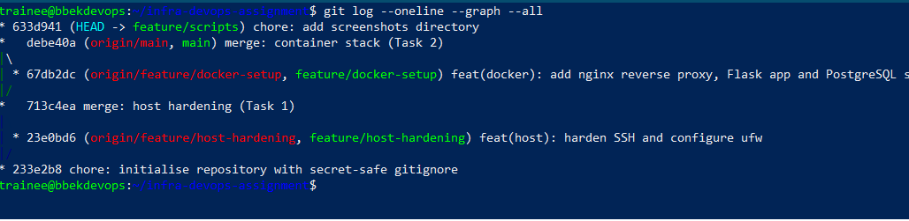

This is my submission for the TechKraft trainee assignment. I built an Ubuntu
VM on my home Proxmox server, hardened it, and ran a small web stack on it
with Docker. There are also two bash scripts, one for health checks and one
for database backups, plus Prometheus for metrics.

## My setup

| | |
|---|---|
| Hypervisor | Proxmox VE 9.2.10 |
| VM OS | Ubuntu 26.04.1 LTS |
| Hostname | bbekdevops |
| IP | 192.168.18.106/24, gateway 192.168.18.1 |
| Interface | ens18 |
| User | trainee, sudo, SSH key only on port 2222 |

I used a full VM instead of an LXC container. Docker inside LXC needs extra
settings turned on, and ufw inside a container shares firewall tables with
the Proxmox host, which makes `ufw status` confusing. A VM has its own kernel
so both just work normally.

## How it fits together

```
             port 80 on the host
                     |
              infra_proxy (nginx)
                     |
              infra_app (Flask, port 5000)
                     |
              infra_db (PostgreSQL 16, volume pgdata)

  infra_prometheus  <- infra_node_exporter
                    <- infra_cadvisor
```

nginx is the only container with a host port. The app uses `expose` instead
of `ports`, so port 5000 is only reachable from inside Docker. If I had used
`ports: 5000:5000` then anyone could skip nginx and hit the app directly,
which would make the reverse proxy pointless.

The database is on a separate network with `internal: true`. That means it
has no route out to the internet, and nginx cannot reach it either. Only the
app is on both networks.

## What is in the repo

```
app/                          Flask app and its Dockerfile
nginx/conf.d/default.conf     proxy config
scripts/                      infra_health_check.sh and db_backup.sh
config/                       copies of config files that live outside the repo
monitoring/prometheus.yml     scrape config
docs/screenshots/             screenshots
docker-compose.yml            main stack
docker-compose.monitoring.yml monitoring stack
.env.example                  template, the real .env is gitignored
```

## Setup steps

### 1. Host hardening

Make the user:

```bash
sudo adduser trainee
sudo usermod -aG sudo trainee
```

Then I copied my public key from Windows into
/home/trainee/.ssh/authorized_keys and made sure the permissions were 700 on
the folder and 600 on the file. SSH ignores keys if the permissions are too
open and the error just says "permission denied", so this is easy to get
wrong.

SSH config:

```bash
sudo tee /etc/ssh/sshd_config.d/01-hardening.conf > /dev/null <<'EOF'
Port 2222
PermitRootLogin no
PasswordAuthentication no
PubkeyAuthentication yes
KbdInteractiveAuthentication no
AllowUsers trainee
EOF

sudo sshd -t
```

Two things I got stuck on here.

First, I named the file 01-hardening.conf and not 99-. The main sshd_config
includes everything in sshd_config.d/ in alphabetical order, and sshd uses
the first value it finds for a setting, not the last. So a file starting with
99 would lose to any file the distro already put there.

Second, and this one took me a while: changing the port did nothing at first.
Ubuntu starts SSH through ssh.socket, so systemd owns the port instead of
sshd. I had to turn that off:

```bash
sudo systemctl disable --now ssh.socket
sudo systemctl enable --now ssh.service
```

After that `ss -tlnp` showed 2222 properly.

Firewall:

```bash
sudo ufw default deny incoming
sudo ufw default allow outgoing
sudo ufw allow 2222/tcp comment 'SSH'
sudo ufw allow 80/tcp   comment 'HTTP'
sudo ufw allow 443/tcp  comment 'HTTPS'
sudo ufw enable
```

I added the rule for 2222 before enabling ufw, and I kept a second SSH
session open the whole time in case I locked myself out. I also took a
Proxmox snapshot first.

### 2. Docker stack

```bash
git clone git@github.com:Bbek10/infra-devops-trainee-assignment.git
cd infra-devops-trainee-assignment
cp .env.example .env
```

Put a real password in .env, then:

```bash
chmod 600 .env
docker compose up -d --build
```

I installed Docker from Docker's own apt repo rather than `apt install
docker.io`, because the Ubuntu package is older and does not include the
compose plugin.

### 3. Scripts

```bash
sudo install -d -m 755 /opt/scripts
sudo install -m 755 scripts/infra_health_check.sh /opt/scripts/
sudo install -m 755 scripts/db_backup.sh /opt/scripts/
sudo touch /var/log/infra_health.log
sudo chmod 644 /var/log/infra_health.log
sudo install -m 644 config/cron.d-infra-health /etc/cron.d/infra-health
sudo systemctl restart cron
```

The cron file runs the health check every 15 minutes. Files in /etc/cron.d
have to be owned by root, mode 644, and have no dot in the filename or cron
just ignores them without telling you. The cron file also sets PATH,
otherwise docker is not found because cron runs with a very small PATH.

### 4. Monitoring

```bash
docker compose -f docker-compose.yml -f docker-compose.monitoring.yml up -d
```

## How to check everything works

### Firewall

```bash
sudo ufw status verbose
sudo sshd -T | grep -Ei '^(port|permitrootlogin|passwordauthentication|pubkeyauthentication)'
sudo ss -tlnp | grep sshd
```

`sshd -T` shows the settings that are actually in effect after all the
include files are read, which is more reliable than reading the config file.

I also checked the things that should fail:

```bash
ssh -p 22 trainee@192.168.18.106
ssh -p 2222 root@192.168.18.106
ssh -p 2222 -o PubkeyAuthentication=no trainee@192.168.18.106
```

Those give connection refused, permission denied, and permission denied.

### Containers

```bash
docker compose ps
docker compose logs --tail 20 app
```

All three should say healthy, and only infra_proxy should have a host port.

### Reverse proxy

```bash
curl -s -o /dev/null -w "%{http_code}\n" localhost
curl -s localhost/healthz
```

That gives 200 and {"database":"up","status":"ok"}.

Checking the app is not reachable directly:

```bash
curl -s --max-time 3 localhost:5000 || echo "port 5000 not reachable from host (correct)"
```

Checking the network split:

```bash
docker compose exec proxy sh -c "getent hosts db || echo 'db not resolvable from proxy (correct)'"
docker compose exec app python -c "import socket; print(socket.gethostbyname('db'))"
```

nginx cannot resolve db but the app can. Containers find each other by
service name using Docker's built in DNS.

### Database persistence

```bash
curl -s localhost | grep -E 'Visits recorded|First visit' -A1
docker compose down
docker compose up -d
sleep 20
curl -s localhost | grep -E 'Visits recorded|First visit' -A1
```

The app writes a row every time you load the page. After down and up the
"first visit" timestamp is still the same, which shows the data is in the
pgdata volume and not inside the container.

Worth knowing: `down` keeps the volume, `down -v` deletes it.

### Health check

```bash
sudo /opt/scripts/infra_health_check.sh; echo "exit=$?"
sudo tail -20 /var/log/infra_health.log
```

Exit code 0 means fine, 1 means at least one warning.

To test the warnings without actually filling up the disk or breaking
anything:

```bash
docker compose stop app
sudo /opt/scripts/infra_health_check.sh
docker compose start app

sudo DISK_THRESHOLD=1 /opt/scripts/infra_health_check.sh
```

I made the threshold an environment variable so it can be tested like this.

### Metrics

```bash
curl -s 'localhost:9090/api/v1/query?query=up'
```

All three targets return "1".

Prometheus is bound to 127.0.0.1 only, because ufw only allows 2222, 80 and
443 and I did not want to open another port. To see the web UI I forward the
port over SSH from my laptop:

```bash
ssh -N -L 9090:127.0.0.1:9090 -p 2222 trainee@192.168.18.106
```

Then open http://localhost:9090/targets in the browser.

## Backups and restore

```bash
sudo /opt/scripts/db_backup.sh
sudo ls -lh /var/backups/db/
```

This writes /var/backups/db/db_backup_YYYYMMDD.sql.gz with permissions 600.
The script dumps to a temp file first and checks it is not empty before
renaming it, so if pg_dump fails there is no broken backup file left sitting
there looking fine. It also deletes backups older than 7 days.

The assignment says .tar.gz but the filename it asks for ends in .sql.gz, so
I just gzipped the SQL file. There is only one file so tar is not needed.

### Restore command

```bash
gunzip -c /var/backups/db/db_backup_YYYYMMDD.sql.gz | docker compose exec -T db psql -U appuser -d appdb
```

I run pg_dump with --clean --if-exists so the dump drops the old tables
first. That way the restore works even if the database already has data in
it.

The -T is important. Without it Docker gives the command a terminal and adds
carriage returns to the output, which breaks the dump file.

### I actually tested the restore

```
rows before        7
after TRUNCATE     0
after restore      6
```

It came back as 6 and not 7 because I loaded the page once more after taking
the backup, so that row was never in the backup. That is the tradeoff with
scheduled backups, you can only restore to when the backup ran. Running them
more often, or setting up WAL archiving, would reduce that gap.

## Teardown

Stop everything but keep the data:

```bash
docker compose -f docker-compose.yml -f docker-compose.monitoring.yml down
```

Delete everything including the database:

```bash
docker compose -f docker-compose.yml -f docker-compose.monitoring.yml down -v
docker image rm infra-assignment-app:1.0
```

Undo the host changes:

```bash
sudo rm /etc/cron.d/infra-health
sudo rm -rf /opt/scripts
sudo rm /etc/ssh/sshd_config.d/01-hardening.conf
sudo systemctl restart ssh
sudo ufw reset
```

## Things I noticed

Docker gets around ufw. I tested this by deleting the ufw rule for port 80
and the site still loaded from my laptop. Docker adds its own iptables rules
that get checked before ufw's rules do, so ufw does not really control
published container ports. It does not cause a problem here because port 80
is supposed to be open anyway, but it means `ufw status` is not the full
picture. The ways around it are binding the port to 127.0.0.1, putting rules
in the DOCKER-USER chain, or turning off Docker's iptables management. This
is why I bound Prometheus to 127.0.0.1 instead of opening port 9090.

Being in the docker group is basically root. Anyone in that group can mount
the whole host filesystem into a container and write to it as root. I added
trainee to the group anyway because this is a single purpose VM, but on a
real server rootless Docker would be better.

The IP comes from DHCP. A real server should have a static IP or a DHCP
reservation so the address in the docs stays correct.

No HTTPS. Port 443 is open in the firewall but nginx only serves HTTP.
Certificates were not part of the assignment.

The app container runs as a non-root user, set in the Dockerfile.

## Where each task is covered

| Task | Where |
|---|---|
| 1, provisioning and hardening | config/01-hardening.conf, config/ufw-rules.txt, screenshot 01 |
| 2, containers and reverse proxy | docker-compose.yml, nginx/conf.d/default.conf, app/, screenshots 02 and 03 |
| 3, health script and cron | scripts/infra_health_check.sh, config/cron.d-infra-health, screenshots 04 and 05 |
| 4, backups and metrics | scripts/db_backup.sh, monitoring/prometheus.yml, screenshots 06 and 07 |
| 5, git and docs | branch history and this README |

## Screenshots

### Firewall and SSH


### Running containers


### App through the reverse proxy


### Health check run


### Health check log


### Backup and restore test


### Prometheus targets



### Git branch history

